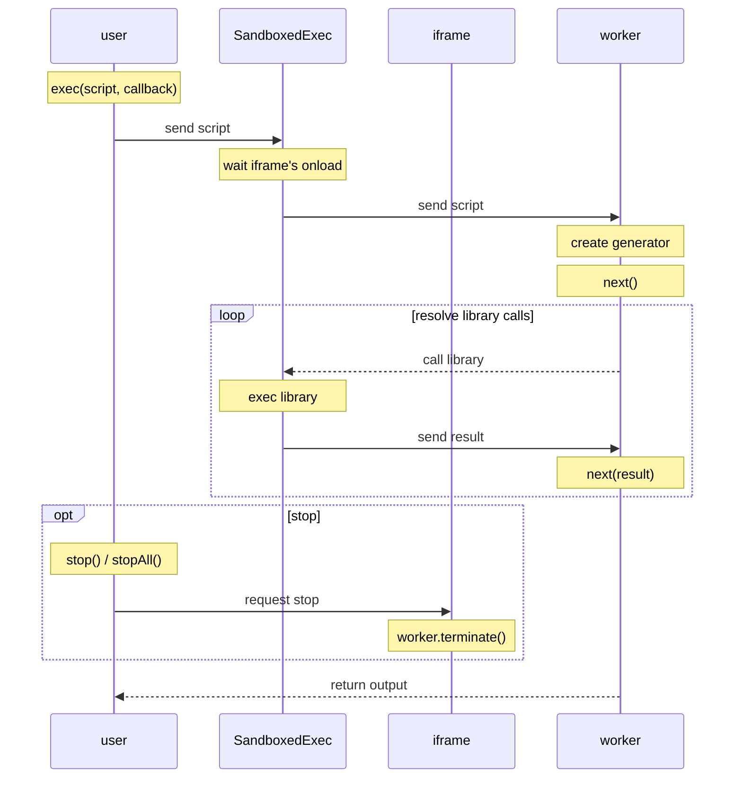

# SandboxedExec

## WARNING

This project is experimental version so don't use this now. Some destructive changes are planned.

## Usage

```typescript
// 1. Init
const sandbox = new SandboxedExec({
  library: {
    add: (x: number, y: number) => x + y,
  },
});

// 2. Append
document.body.appendChild(sandbox.iframe);

// 3. Exec
const stop = sandbox.exec(`output("sum", yield add(1, 2))`, (result) => {
  if (result.status === "Executed") {
    console.log(result.outputs.sum); // 3    
  }

  console.log(result);
  /*\
   | { status: "Executed", outputs: { sum: 3 }, error: null }
   | { status: "Library Error", libraryError: null }
   | { status: "Terminated" }
   | { status: "Revoked" }
  \*/
});

// 4. Stop (If you want)
stop(); // or sandbox.stopAll();

```

## Sketch of Implementation

Please see this [sequence diagram](https://mermaid.ink/svg/eyJjb2RlIjoic2VxdWVuY2VEaWFncmFtXG5wYXJ0aWNpcGFudCB1c2VyIGFzIHVzZXJcbnBhcnRpY2lwYW50IHJjdHggYXMgU2FuZGJveGVkRXhlY1xucGFydGljaXBhbnQgaWN0eCBhcyBpZnJhbWVcbnBhcnRpY2lwYW50IHdrZXIgYXMgd29ya2VyXG5cbk5vdGUgb3ZlciB1c2VyOiBleGVjKHNjcmlwdCwgY2FsbGJhY2spXG51c2VyIC0-PiByY3R4OiBzZW5kIHNjcmlwdFxuTm90ZSBvdmVyIHJjdHg6IHdhaXQgaWZyYW1lJ3Mgb25sb2FkXG5yY3R4IC0-PiB3a2VyOiBzZW5kIHNjcmlwdFxuTm90ZSBvdmVyIHdrZXI6IGNyZWF0ZSBnZW5lcmF0b3Jcbk5vdGUgb3ZlciB3a2VyOiBuZXh0KClcblxubG9vcCByZXNvbHZlIGxpYnJhcnkgY2FsbHNcbiAgd2tlciAtLT4-IHJjdHg6IGNhbGwgbGlicmFyeVxuICBOb3RlIG92ZXIgcmN0eDogZXhlYyBsaWJyYXJ5XG4gIHJjdHggLT4-IHdrZXI6IHNlbmQgcmVzdWx0XG4gIE5vdGUgb3ZlciB3a2VyOiBuZXh0KHJlc3VsdClcbmVuZFxuXG5vcHQgc3RvcFxuICBOb3RlIG92ZXIgdXNlcjogc3RvcCgpIC8gc3RvcEFsbCgpXG4gIHVzZXIgLT4-IGljdHg6IHJlcXVlc3Qgc3RvcFxuICBOb3RlIG92ZXIgaWN0eDogd29ya2VyLnRlcm1pbmF0ZSgpXG5lbmRcblxud2tlciAtLT4-IHVzZXI6IHJldHVybiBvdXRwdXRcbiIsIm1lcm1haWQiOnt9LCJ1cGRhdGVFZGl0b3IiOmZhbHNlfQ). Below is the diagram's code written in mermaid.



