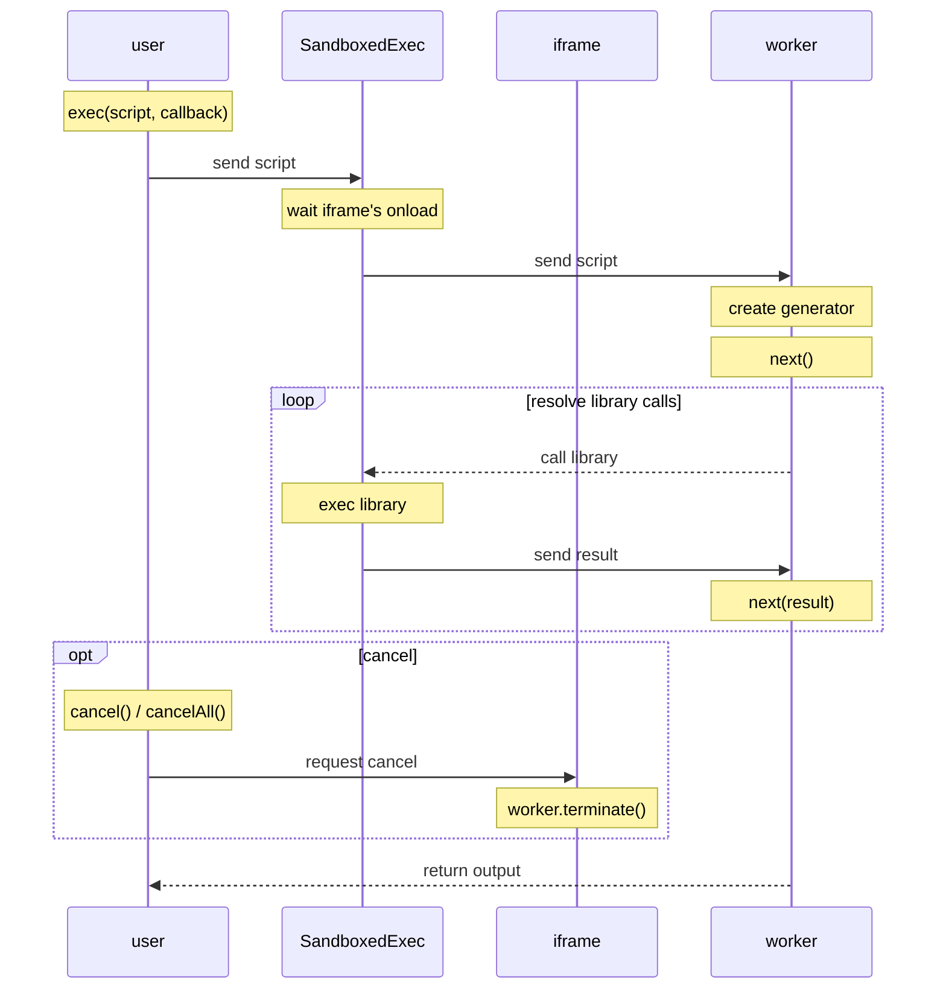

# SandboxedExec

## WARNING

This project is experimental version so don't use this now. Some destructive changes are planned.

## Usage

```typescript
// 1. Init
const sandbox = new SandboxedExec({
  library: {
    add: (x: number, y: number) => x + y,
  },
});

// 2. Append
document.body.appendChild(sandbox.iframe);

// 3. Exec
const stop = sandbox.exec(`output("sum", yield add(1, 2))`, (result) => {
  if (result.status === "Executed") {
    console.log(result.outputs.sum); // 3    
  }
});

// 4. Cancel (If you want)
stop(); // or sandbox.stopAll();

```

## Sketch of Implementation

Please see this [sequence diagram](https://mermaid.ink/svg/eyJjb2RlIjoic2VxdWVuY2VEaWFncmFtXG5wYXJ0aWNpcGFudCB1c2VyIGFzIHVzZXJcbnBhcnRpY2lwYW50IHJjdHggYXMgU2FuZGJveGVkRXhlY1xucGFydGljaXBhbnQgaWN0eCBhcyBpZnJhbWVcbnBhcnRpY2lwYW50IHdrZXIgYXMgd29ya2VyXG5cbk5vdGUgb3ZlciB1c2VyOiBleGVjKHNjcmlwdCwgY2FsbGJhY2spXG51c2VyIC0-PiByY3R4OiBzZW5kIHNjcmlwdFxuTm90ZSBvdmVyIHJjdHg6IHdhaXQgaWZyYW1lJ3Mgb25sb2FkXG5yY3R4IC0-PiB3a2VyOiBzZW5kIHNjcmlwdFxuTm90ZSBvdmVyIHdrZXI6IGNyZWF0ZSBnZW5lcmF0b3Jcbk5vdGUgb3ZlciB3a2VyOiBuZXh0KClcblxubG9vcCByZXNvbHZlIGxpYnJhcnkgY2FsbHNcbiAgd2tlciAtLT4-IHJjdHg6IGNhbGwgbGlicmFyeVxuICBOb3RlIG92ZXIgcmN0eDogZXhlYyBsaWJyYXJ5XG4gIHJjdHggLT4-IHdrZXI6IHNlbmQgcmVzdWx0XG4gIE5vdGUgb3ZlciB3a2VyOiBuZXh0KHJlc3VsdClcbmVuZFxuXG5vcHQgY2FuY2VsXG4gIE5vdGUgb3ZlciB1c2VyOiBjYW5jZWwoKSAvIGNhbmNlbEFsbCgpXG4gIHVzZXIgLT4-IGljdHg6IHJlcXVlc3QgY2FuY2VsXG4gIE5vdGUgb3ZlciBpY3R4OiB3b3JrZXIudGVybWluYXRlKClcbmVuZFxuXG53a2VyIC0tPj4gdXNlcjogcmV0dXJuIG91dHB1dFxuIiwibWVybWFpZCI6e30sInVwZGF0ZUVkaXRvciI6ZmFsc2V9). Below is the diagram's code written in mermaid.



